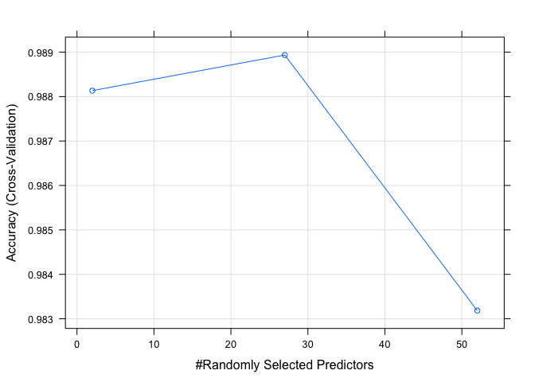
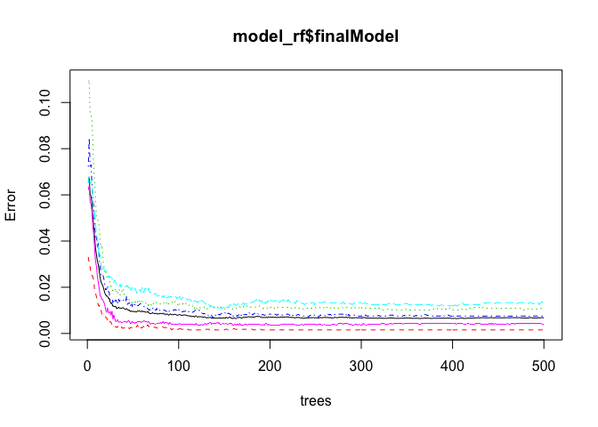
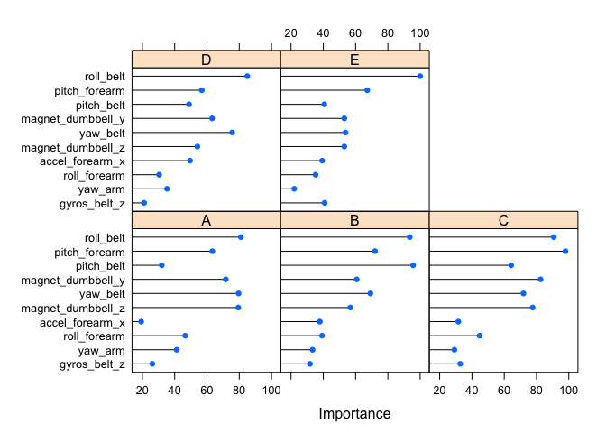
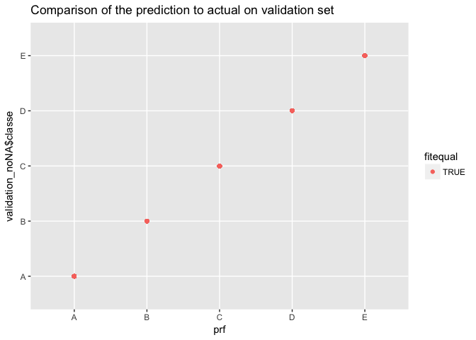

# The problem
The goal of this project is to predict the manner in which they did the exercise. This is the "classe" variable (A, B, C, D, E) describing how well someone has lifted weights. This report describes the predictive model, how it was validated, and the expected out of sample error, and the assumptions and choices made. The model is then used to predict the classe on a test set of 20 observations.

# The Data
The data was used was the Weight Lifting Exercises Dataset published by Velloso et al (2013), more information can be found in the paper below and online at http://web.archive.org/web/20161224072740/http:/groupware.les.inf.puc-rio.br/har 

Velloso, E.; Bulling, A.; Gellersen, H.; Ugulino, W.; Fuks, H. Qualitative Activity Recognition of Weight Lifting Exercises. Proceedings of 4th International Conference in Cooperation with SIGCHI (Augmented Human '13) . Stuttgart, Germany: ACM SIGCHI, 2013.

The data comprises over 19,000 observations of healthy participants who were asked to perform repetitions of the Unilateral Dumbbell Biceps Curl in five different fashions: exactly according to the specification (Class A), throwing the elbows to the front (Class B), lifting the dumbbell only halfway (Class C), lowering the dumbbell only halfway (Class D) and throwing the hips to the front (Class E).

The classe variable has 5 categories. Class A corresponds to the specified execution of the exercise, while the other 4 classes correspond to common mistakes. 

Participants movement was measured using sensors. The project uses these measurements to predict the classe variable. 

## Data download
Data sources for training and testing sets

```r
urltrain <- "https://d396qusza40orc.cloudfront.net/predmachlearn/pml-training.csv"
urltest <- "https://d396qusza40orc.cloudfront.net/predmachlearn/pml-testing.csv"
```

Training dataset:
If file not present, download from url

```r
filetrain <- "pml-training.csv"
if(!file.exists(filetrain)){
  cat("Downloading training data file...\n")
  download.file(urltrain,filetrain) 
}
```

Testing dataset:
If file not present, download from url

```r
# Test dataset
filetest <- "pml-testing.csv"
if(!file.exists(filetest)){
  cat("\nDownloading testing data file...\n")
  download.file(urltest,filetest) # Use "wb" mode for binary file downloads
}
```


## Read the data

```r
train <- read.csv(filetrain, header=TRUE,na.strings=c("NA",""))
test <- read.csv(filetest, header=TRUE,na.strings=c("NA",""))
```

## Inspecting the data
The training and test datasets have 159 common variables, and one additional variable which is different in the two datasets. The training data contains the dependent factor variable "classe" with 5 categories A-E which categorises the manner in which the weight was lifted. This variable is not present in the test data. Instead there is an independent variable  "problem_id" which identifies the number of the test observation.


```r
# glimpse(as.tibble(train))
```

# Cleaning the data
The activity related features are converted to numeric variables and extracted to use for the prediction.


```r
train[,7:159] <- sapply(train[,7:159],as.numeric) 
test[,7:159] <- sapply(test[,7:159], as.numeric) 

# select the activity features only
train <- train[8:160]
test <- test[8:160]
```

Inspection of the data showed that it includes many NA values. Removal of observations with one or more NAs resulted in too many observations being discarded. A more effective method was to only remove the columns with one or more NAs.

```r
# Find NA free columns
cat("Removing NAs...\n")
```

```
## Removing NAs...
```

```r
common_cols <- intersect(colnames(train), colnames(test))
both <- rbind(train[, common_cols], test[, common_cols])
both_noNA <- both[, colSums(is.na(both)) == 0] 
noNA_cols <- colnames(both_noNA)

# Reform train and test datasets without NA cols
train_noNA <- cbind(classe=train$classe, both_noNA[1:19622,noNA_cols])
test_noNA <- cbind(problem_id=test$problem_id, both_noNA[19623:19642, noNA_cols])
rm(both, both_noNA, common_cols, noNA_cols, filetrain, filetest)
```
The fraction of NA values before cleaning was 0.6400712 in the training set and 0.6535948 in the testing set.

The fraction of NA values after cleaning was
0 in the training set and 0 in the testing set.

The same columns were removed from both the training and the test sets, leaving 53 activity features for model building.


## Preparing for cross validation
A validation set was creating using 30% of the training set.
<!-- K fold validation was tried but was found to be very slow for this size dataset. Instead, a subset of the training data was excluded to use as a validation set.  -->

```r
# Create a validation set using 30% of the NA-cleaned training set
cat("Creating a validation set...\n")
```

```
## Creating a validation set...
```

```r
set.seed(123)
inTrain <- createDataPartition(train_noNA$classe, p=0.70)[[1]]
train_noNA <- train_noNA[inTrain,]
validation_noNA <- train_noNA[-inTrain,]
```

## Free up memory
To clear disk space, the variables which are no longer needed are removed.

```r
cat("Memory clean up...\n")
```

```
## Memory clean up...
```

```r
rm(train, test)
```


# Modelling
As the problem was a classification problem, a random forests model was used. The model was built using all other predictors except the classe. K-fold validation using 3 folds was used with the random forest method in the caret package.

Time model building started: Fri 20 Jul 12:35:21

```r
cat("Building a model...\n")
```

```
## Building a model...
```

```r
set.seed(32343)
# model_rf <- train(classe ~., data=train_noNA, method="rf") # w/o k-folds
model_rf <- train(classe ~ ., method = "rf", data = train_noNA, importance = TRUE, trControl = trainControl(method = "cv", number = 3)) # with 3 k-folds

model_rf$finalModel # to print model coefficients
```

```
## 
## Call:
##  randomForest(x = x, y = y, mtry = param$mtry, importance = TRUE) 
##                Type of random forest: classification
##                      Number of trees: 500
## No. of variables tried at each split: 27
## 
##         OOB estimate of  error rate: 0.68%
## Confusion matrix:
##      A    B    C    D    E class.error
## A 3900    3    0    0    3 0.001536098
## B   22 2629    6    1    0 0.010910459
## C    0   10 2378    8    0 0.007512521
## D    0    0   30 2221    1 0.013765542
## E    0    1    4    5 2515 0.003960396
```

Time model building finished: Fri 20 Jul 12:53:28


```r
# Plots of final model
plot(model_rf)
```

<!-- -->

```r
plot(model_rf$finalModel)
```

<!-- -->

```r
plot(varImp(model_rf), top = 10)
```

<!-- -->

```r
vi <- varImp(model_rf)
vi$importance[1:10,]
```

```
##                          A         B         C         D          E
## roll_belt        81.057725 93.526652 90.684513 85.010766 100.000000
## pitch_belt       31.998977 95.626618 64.267639 48.895825  40.638848
## yaw_belt         79.598415 69.148380 71.894291 75.644961  53.766580
## total_accel_belt  1.877859  4.421607  1.926328  3.377069   3.701256
## gyros_belt_x     23.231597  9.921856 17.116012  8.231036  11.299342
## gyros_belt_y      0.000000  9.319639 11.858311  8.750887  13.924846
## gyros_belt_z     26.149937 31.774964 32.749132 21.062535  40.835677
## accel_belt_x      5.793669  7.434317  7.353555  2.507310   5.455138
## accel_belt_y      1.011845  8.930352  9.245188  8.004008   1.353120
## accel_belt_z     13.322244 23.379420 21.137679 19.939167  12.653913
```

The cross validation graph shows that the model with 27 predictors has the highest accuracy and is selected as the best fit. The accuracy of the best fit random forest model is 99%. A list of top ten important predictor variables in the model is also given for each class of activity.

The final model plot shows that the overall error converged to near zero at around 100 trees. The algorithm could be speeded up by tuning to limit the number of trees. 
The out of sample error is 0.68% calculated using the out of bag method. 


## Validation
The model was validated using the validation data set.

```r
# Test on validation set
cat("Predicting on the validation set...\n")
```

```
## Predicting on the validation set...
```

```r
prf <- predict(model_rf, newdata=validation_noNA)

# Compare predictions to actual measurement in the testing dataset
confusionMatrix(prf, validation_noNA$classe)
```

```
## Confusion Matrix and Statistics
## 
##           Reference
## Prediction    A    B    C    D    E
##          A 1161    0    0    0    0
##          B    0  791    0    0    0
##          C    0    0  739    0    0
##          D    0    0    0  655    0
##          E    0    0    0    0  771
## 
## Overall Statistics
##                                      
##                Accuracy : 1          
##                  95% CI : (0.9991, 1)
##     No Information Rate : 0.282      
##     P-Value [Acc > NIR] : < 2.2e-16  
##                                      
##                   Kappa : 1          
##  Mcnemar's Test P-Value : NA         
## 
## Statistics by Class:
## 
##                      Class: A Class: B Class: C Class: D Class: E
## Sensitivity             1.000   1.0000   1.0000   1.0000   1.0000
## Specificity             1.000   1.0000   1.0000   1.0000   1.0000
## Pos Pred Value          1.000   1.0000   1.0000   1.0000   1.0000
## Neg Pred Value          1.000   1.0000   1.0000   1.0000   1.0000
## Prevalence              0.282   0.1921   0.1795   0.1591   0.1873
## Detection Rate          0.282   0.1921   0.1795   0.1591   0.1873
## Detection Prevalence    0.282   0.1921   0.1795   0.1591   0.1873
## Balanced Accuracy       1.000   1.0000   1.0000   1.0000   1.0000
```

```r
# Calculate accuracy on validation set
tabrf <- table(prf, validation_noNA$classe)
print(tabrf)
```

```
##    
## prf    A    B    C    D    E
##   A 1161    0    0    0    0
##   B    0  791    0    0    0
##   C    0    0  739    0    0
##   D    0    0    0  655    0
##   E    0    0    0    0  771
```

```r
fitequal = (prf==validation_noNA$classe)
p <- qplot(prf, validation_noNA$classe, colour=fitequal,
                 main="Comparison of the prediction to actual on validation set")
plot(p)
```

<!-- -->

Testing of the best fit model on the validation set found an even higher accuracy, with all observations being correctly predicted.


# Prediction of the class on the test data set
The class was predicted by applying the best fit random forest model to the test set. The following classes were predicted for each test observation:

```r
# Predict on test set
test_noNA$classe <- as.character(predict(model_rf, newdata=test_noNA))
cat("Prediction on test set:\n")
```

```
## Prediction on test set:
```

```r
print(test_noNA$classe)
```

```
##  [1] "B" "A" "B" "A" "A" "E" "D" "B" "A" "A" "B" "C" "B" "A" "E" "E" "A"
## [18] "B" "B" "B"
```

```r
for (i in 1:20) cat(i, ": ", test_noNA$classe[i], "\n")
```

```
## 1 :  B 
## 2 :  A 
## 3 :  B 
## 4 :  A 
## 5 :  A 
## 6 :  E 
## 7 :  D 
## 8 :  B 
## 9 :  A 
## 10 :  A 
## 11 :  B 
## 12 :  C 
## 13 :  B 
## 14 :  A 
## 15 :  E 
## 16 :  E 
## 17 :  A 
## 18 :  B 
## 19 :  B 
## 20 :  B
```

